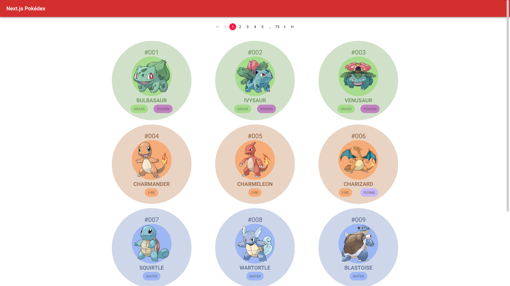
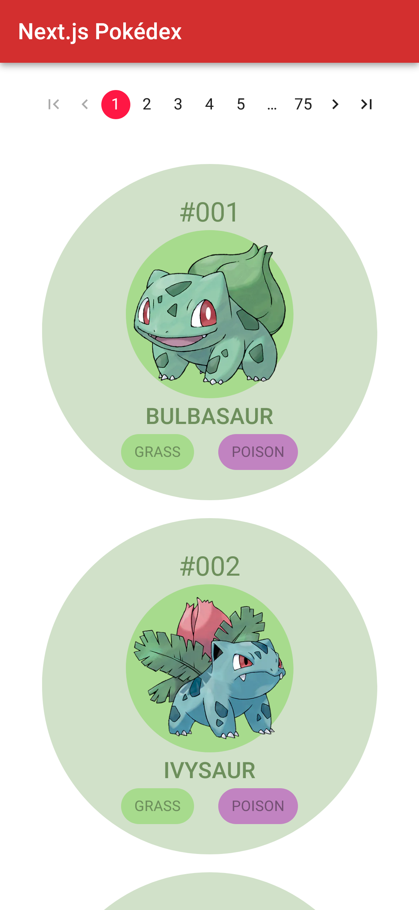

# Next.js Pokédex

Nothing is more useful than a Pokédex when you begin your journey to become a Pokémon Master. This Pokédex will help you identify and learn more about each Pokémon.

## Link

Go see the Pokédex in action [here](https://my-nextjs-pokedex.vercel.app/)

## Features

- List of Pokémon that show the name of each Pokémon
- A picture for identification
- View specific information of each individual Pokémon
- A pagination component
- Responsive design

## Screenshots

### Desktop View

### Mobile View

## Built with

- [Next.js](https://nextjs.org/)
- [MUI](https://mui.com/)
- [PokéApi](https://pokeapi.co/)

## Run locally

1. Clone this repo
2. Run `npm install`
3. Run `npm run dev`
4. Open the application in `https://localhost:3000/` or any other available port

## To Do

- [x] Return to Home button
- [ ] Evolution chains
- [ ] Filter Pokémon based on Generation and Type
- [ ] Search Pokémon by its Name/ID
- [ ] Scroll to top for mobile
